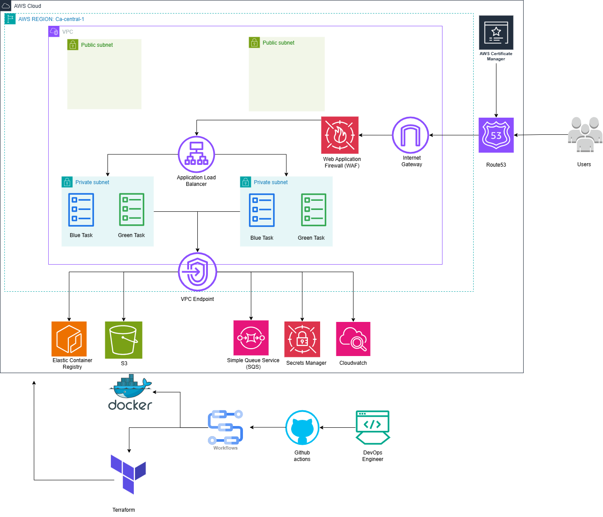
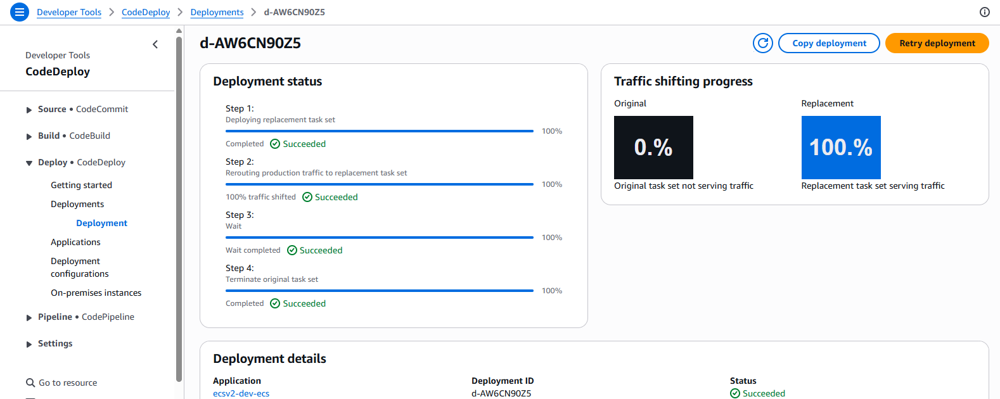
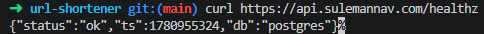
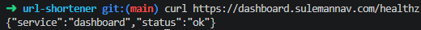
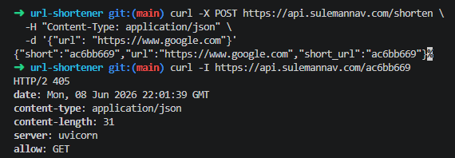
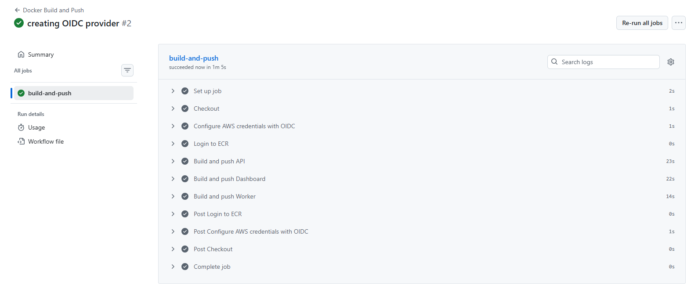
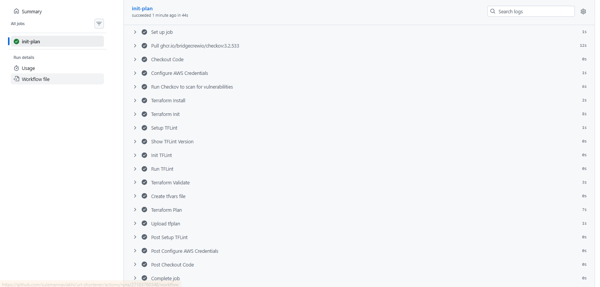
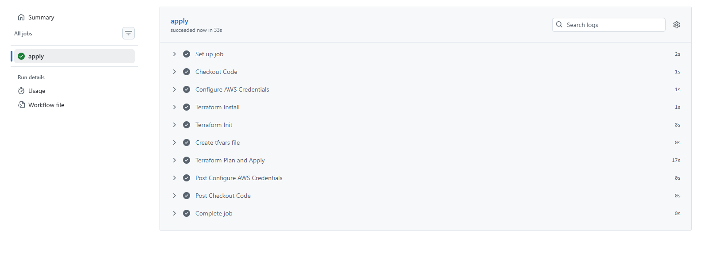

# URL Shortener Production-Grade AWS Deployment

## Introduction

This project is a URL shortening service with click analytics, built and deployed on AWS. The application consists of three services. An API that shortens URLs, handles redirects, and publishes click events. A worker that processes those events and writes analytics to a database and a dashboard that exposes the analytics

The goal was to take provided application code and build everything around it in a way that reflects real production engineering standards. This meant making deliberate decisions about security, cost, reliability, and deployment safety rather than just getting the services running.

The result is a fully automated system where a developer pushing to main triggers a pipeline that builds, scans, and deploys all three services to AWS ECS Fargate with zero downtime. Traffic shifts gradually from the old version to the new one using a canary deployment strategy, and automatically rolls back if health checks fail. No manual steps, no hardcoded secrets, no long-lived credentials.

## Architecture


---

## Decisions, Trade-offs, and Database Justification

### Database: PostgreSQL over DynamoDB

PostgreSQL was chosen over DynamoDB because the dashboard needs to answer questions like "which URLs got the most clicks?" and "how many clicks happened each hour?". These questions require looking across many rows of data and summarising them. PostgreSQL is built for this. For example;

```sql
SELECT short_code, COUNT(*) FROM click_events
GROUP BY short_code ORDER BY COUNT DESC LIMIT 10;
```

DynamoDB is optimised for simple key lookups at massive scale. It would require either duplicating data across multiple tables or running expensive scans to answer the same questions. PostgreSQL answers them in a single query.

### VPC Endpoints over NAT Gateway

VPC endpoints were used to give private subnet resources direct access to AWS services such as ECR, SQS, Secrets Manager, CloudWatch and S3 without routing traffic to the internet. NAT Gateways cost more per month than VPC endpoints and are public facing whereas VPC Endpoints keep all traffic inside the AWS network, removing the security risk for private resources.

### Blue/Green Deployments with CodeDeploy

API and dashboard services use CodeDeploy blue/green deployments with a canary configuration. 10% of traffic shifts to the new version, waits 5 minutes, then shifts the remaining 90%. If health checks fail during that window, CodeDeploy automatically rolls back.

The worker service uses a straight ECS deployment. It polls SQS in the background and a failed deployment at worst means a brief gap in click event processing, not user-facing errors.

### Redis Caching

ElastiCache Redis sits in front of RDS on the URL redirect path. Redirects are the highest volume operation. Every short link click hits the API. Without caching, each redirect queries RDS. With Redis, the first request populates the cache and subsequent requests are served from memory in microseconds. Redis adds cost but it was chosen because it protects RDS from being overloaded due to high traffic and keeping redirect speeds fast for the user

---

## Tools and Services

### Docker
Multi-stage Dockerfiles were written for all three services. The build stage compiles or installs dependencies, and the runtime stage copies only the final binary or application into a minimal base image. Images are scanned for vulnerabilities using Trivy before being pushed to ECR.

### Terraform
All infrastructure is defined in Terraform and organised into modules. Remote state is stored in S3 with file-based locking. The objective was to create repeatable, consistent infrastructure that can be deployed and torn down reliably, reducing manual effort and saving engineers hours of work.

### AWS Services
- **ECS Fargate**: serverless container runtime, three services on one cluster
- **ALB**: application load balancer routing traffic by hostname to the correct service
- **WAF**: web application firewall blocking common attacks and rate limiting by IP
- **RDS PostgreSQL**: relational database for URL mappings and click analytics
- **ElastiCache Redis**: in-memory cache for URL lookups on the redirect path
- **SQS**: decoupled queue for click events between the API and worker
- **ECR**: private container registry storing images tagged by git SHA
- **CodeDeploy**: blue/green deployment orchestration with canary traffic shifting
- **Secrets Manager**: stores RDS credentials, injected into containers at runtime by ECS
- **VPC Endpoints**: private connectivity to AWS services without NAT gateways
- **CloudWatch**: log aggregation for all three services
- **ACM**: SSL certificate for HTTPS on the ALB
- **IAM**: least-privilege roles for ECS tasks, CodeDeploy, and GitHub Actions

### GitHub Actions
Three pipelines manage the full delivery lifecycle:

1. **Docker Build and Push** triggered on push to main. Builds images for all three services, scans each with Trivy for critical vulnerabilities, and pushes to ECR tagged with the git SHA and latest.
2. **Terraform Apply** triggered on push to main after the Docker pipeline. Runs `terraform plan` and `terraform apply` to ensure infrastructure matches the configuration. Includes Checkov and TFLint scans for security and best practices.
3. **ECS Deploy** manually triggered. Fetches the latest task definition ARN for each service and creates a CodeDeploy deployment, triggering the blue/green traffic shift.

---

## Deployment Workflow

### Code Merge to Live Traffic

```
developer merges PR to main
        │
        ▼
Docker pipeline triggers
├── builds api image (Python, port 8080)
├── builds dashboard image (Go, port 8081)
├── builds worker image (Go, no port)
├── scans each image with Trivy (CRITICAL severity)
└── pushes SHA tag + latest tag to ECR
        │
        ▼
Terraform pipeline triggers
├── terraform init
├── terraform plan
└── terraform apply
    ├── registers new ECS task definitions with updated image
    └── no changes to other infrastructure
        │
        ▼
ECS Deploy pipeline triggers (manual or automated)
├── fetches latest task definition ARN for api
├── creates CodeDeploy deployment for api
│   ├── deploys replacement task set
│   ├── shifts 10% traffic to new tasks
│   ├── waits 5 minutes — health checks must pass
│   ├── shifts remaining 90% traffic
│   └── terminates original task set
├── repeats for dashboard
└── updates worker service directly (no load balancer)
        │
        ▼
new version is live
```

**Rollback:** If health checks fail during the 5-minute canary window, CodeDeploy automatically shifts all traffic back to the original task set and terminates the replacement. No manual intervention required.

---

### CodeDeploy Blue/Green Deployment


### API Health Check


### Dashboard Health Check


### URL Shortener in Action


### Docker Build and Push Pipeline


### Terraform Init and Plan Pipeline


### Terraform Apply Pipeline
